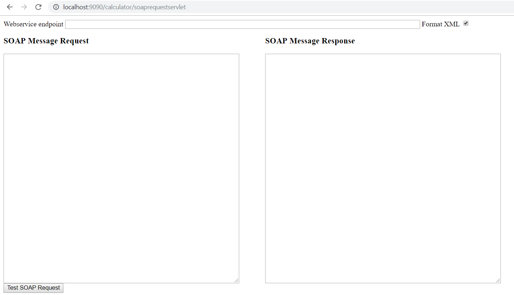

Call a webservice programmatically without webservice library like JAX-WS or Apache Axis.

This is an example extracted from [https://technology.amis.nl/2011/06/29/how-to-call-a-call-a-webservice-directly-from-java-without-webservice-library/](https://technology.amis.nl/2011/06/29/how-to-call-a-call-a-webservice-directly-from-java-without-webservice-library/) with very little changes.

## Pre-requisites

- JVM 1.6+
- Maven plugin and/or Maven runtime 3.0.4+
- Your favorite IDE (optional)

## Web Service

We are using this web service for testing purposes.

```
http://www.dneonline.com/calculator.asmx?wsdl
```


## Run in standalone mode

In your favorite IDE, open this project and select WeatherWebserviceTester class. Then click on 'Run > Run As > Java Application' (Eclipse).

Here is a sample output:


## Run in a browser

```
mvn tomcat7:run
```

Open your browser and go to [http://localhost:9090/calculator/soaprequestservlet](http://localhost:9090/calculator/soaprequestservlet)



Enter your xml request and click on 'Test SOAP Request' button.


# Issues

Please [add issues](https://github.com/carpiodanielj/call-webservice-soap-directly-from-java/issues) if you have a question or found a problem. Pull requests are welcome too!

## License

[MIT](LICENSE.md)